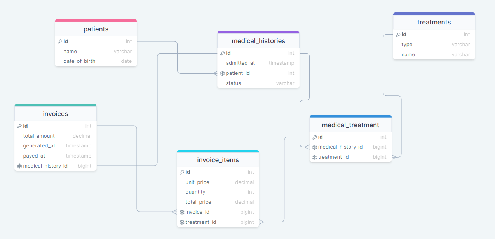

# 📗 Table of Contents

- [📖 About the Project](#about-project)
  - [🛠 Built With](#built-with)
    - [Tech Stack](#tech-stack)
    - [Key Features](#key-features)
  - [🚀 Live Demo](#live-demo)
- [💻 Getting Started](#getting-started)
  - [Setup](#setup)
  - [Prerequisites](#prerequisites)
  - [Install](#install)
  - [Usage](#usage)
  - [Run tests](#run-tests)
  - [Deployment](#triangular_flag_on_post-deployment)
- [👥 Authors](#authors)
- [🔭 Future Features](#future-features)
- [🤝 Contributing](#contributing)
- [⭐️ Show your support](#support)
- [🙏 Acknowledgements](#acknowledgements)
- [❓ FAQ](#faq)
- [📝 License](#license)

<!-- PROJECT DESCRIPTION -->

# 📖 [Entity Relationship Database] 

**[Entity Relationship Database]**  illustrates the Entity Relationship Diagram (ERD) that captures the connections between tables, primary keys, constraints, indexes, and foreign keys within the crafted database design.

### Database Schema Diagram

## 🛠 Built With 

**PostgreSQL Database**

Database

  <ul>
    <li><a href="https://www.postgresql.org/">PostgreSQL</a></li>
  </ul>

<!-- Features -->
### Tech Stack 

### Key Features 

- **[DB tables]**
- **[Primary key]**
- **[Foreign key]**
- **[Constraints]**
- **[Entity]**
- **[Relstionships]**
- **[Diagrams]**

(<a href="#readme-top">back to top</a>)

<!-- LIVE DEMO -->

## 🚀 Live Demo 

- [Live Demo Link](Not yet)

(<a href="#readme-top">back to top</a>)

<!-- GETTING STARTED -->

## 💻 Getting Started 

To get a local copy up and running, follow these steps.

### Prerequisites

In order to run this project you need:

**- Install posgreSQL Server**
**- Install DBMS**

### Setup

Clone this repository to your desired folder:

cd my-folder
git clone https://github.com/zuhebahmed88091/database_based_on_diagram.git

(<a href="#readme-top">back to top</a>)

<!-- AUTHORS -->

## 👥 Authors 

👤 **Zuheb Ahmed**

- GitHub: [&nbsp; &nbsp; @githubhandle](https://github.com/zuhebahmed88091)
- Twitter: [&nbsp; &nbsp; @twitterhandle](https://twitter.com/ZuhebAhmed88091)
- LinkedIn: [&nbsp; LinkedIn](https://www.linkedin.com/in/zuheb-ahmed/)

👤 **Kimita  Wanjohi**

- GitHub: [@kimitawanjohi](https://github.com/kimitawanjohi)
- Twitter: [@myro_dev](https://twitter.com/myro_dev)
- LinkedIn: [kimitawanjohi](https://linkedin.com/in/kimitawanjohi)

(<a href="#readme-top">back to top</a>)

<!-- FUTURE FEATURES -->

## 🔭 Future Features 

- [ ] **[Application to handle db]**
- [ ] **[Deployment]**

(<a href="#readme-top">back to top</a>)

<!-- CONTRIBUTING -->

## 🤝 Contributing 

Contributions, issues, and feature requests are welcome!

Feel free to check the [issues page](https://github.com/zuhebahmed88091/database_based_on_diagram/issues).

(<a href="#readme-top">back to top</a>)

<!-- SUPPORT -->

## ⭐️ Show your support 

If you like this project ⭐️ it on my Github

(<a href="#readme-top">back to top</a>)

<!-- ACKNOWLEDGEMENTS -->

## 🙏 Acknowledgments 

I would like to thank Microverse for the template given to start this project.

(<a href="#readme-top">back to top</a>)

<!-- FAQ (optional) -->

## ❓ FAQ 

- **[Queries completed with erros?]**

  - [Kindly check if PostgreSQL is properly installed.]

- **[Cloned files cannot be opened ?]**

  - [File is .sql extension, you can open it using any text editor]

(<a href="#readme-top">back to top</a>)

<!-- LICENSE -->

## 📝 License 

This project is [MIT](./LICENSE) licensed.

_NOTE: we recommend using the [MIT license](https://choosealicense.com/licenses/mit/) - you can set it up quickly by [using templates available on GitHub](https://docs.github.com/en/communities/setting-up-your-project-for-healthy-contributions/adding-a-license-to-a-repository). You can also use [any other license](https://choosealicense.com/licenses/) if you wish._

(<a href="#readme-top">back to top</a>)
